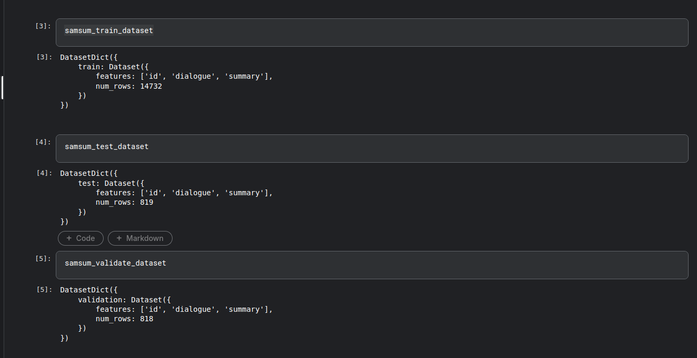
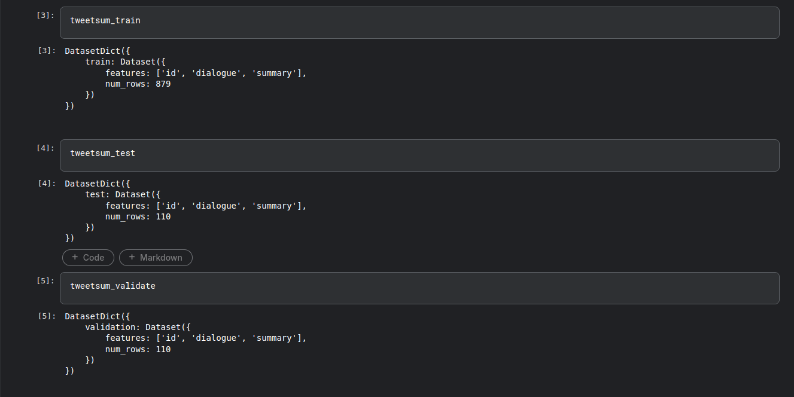
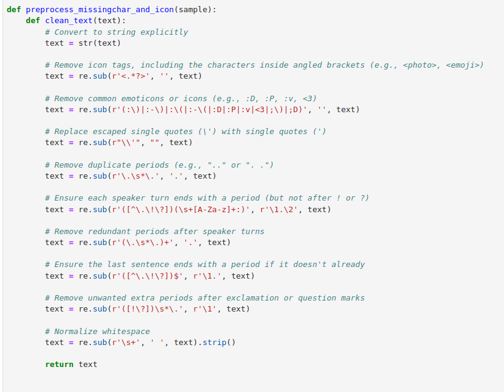
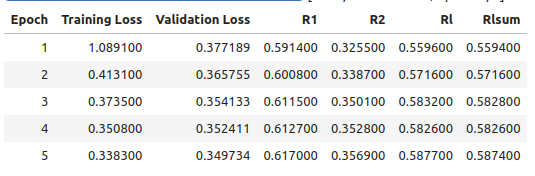
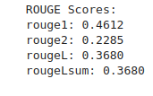
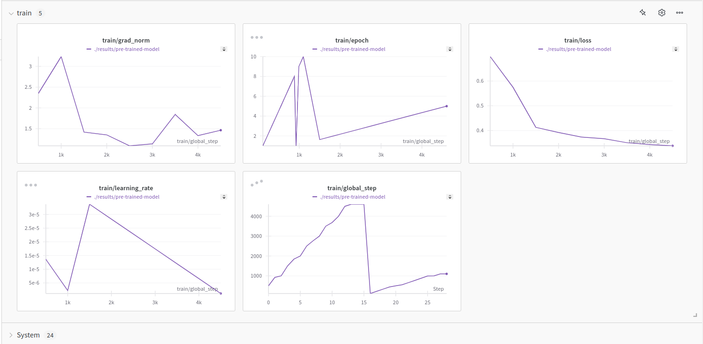
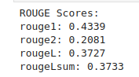
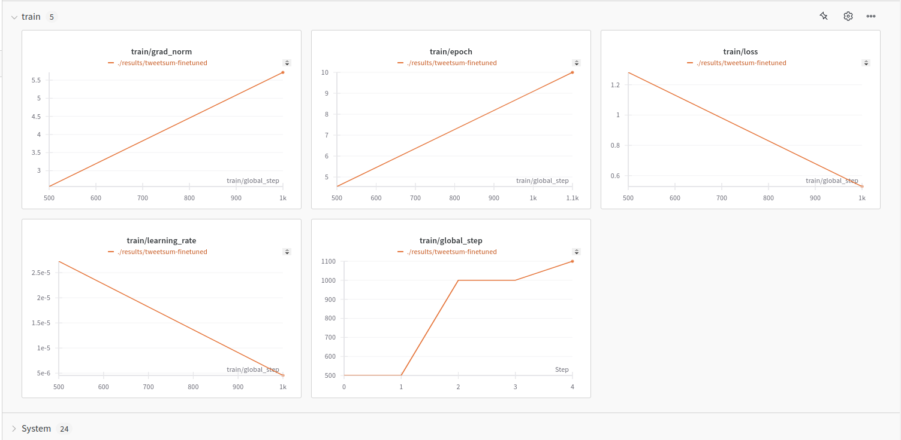

# Dialog summarization system for a RAG chatbot system

## Summary
## Environment setup
## Fine-tuning BART-based with SamSUM and TweeetSUM

 Dataset

In this project, I will conduct on a 2 public dataset called SamSUM(2019) and TweetSUM(2021), in which the 1st will be used for pre-trained and the last one is used for fine-tune purpose.
I have already uploaded 2 datasets to this repos. If you are interested in the original dataset, please see the link below each type of dataset.
 
- **SamSUM dataset**:
 SamSUM is a dataset with the format of messenger-like conversations with summaries, with style and register are diversified.

Dataset link: [Dataset/SamSUM](./Dataset/SamSUM) . For the orignal one, please visit this site [SamSUM](https://paperswithcode.com/dataset/samsum-corpus)
- **TweetSUM dataset**:
TweetSUM is a dataset focused on summarization of dialogs, which represents the rich domain of Twitter customer care conversations

Dataset link: [Dataset/TweetSUM](./Dataset/TweetSUM)  . For the orignal one, please visit this site [TweetSUM](https://github.com/guyfe/Tweetsumm)

Both the dataset will be pre-processed by this script before being fine-tuned by BART-based:
 

 Pre-training with BART-base

 BART-based will first be pre-trained with SamSUM dataset in order to have a better understaanding in general chat format, by the following configuration:
 
 

After the trainning here are some results in terms of ROUGE score for the pre-trained BART-based:

 

Final ROUGE score:

 

Details can be witnessed on wandb records:
 
 

 Fine-tuning BART-SamSUM

 After pre-trainning with BART-based, it will be fine-tuned with TweetSUM for customer-service summary understanding :
 
 

After the trainning here are some results in terms of ROUGE score for the fine-tuned BART-based:

 

Final ROUGE score:

 

Details can be witnessed on wandb records:
 
 

For the fine-tuned checkpoint, I have already uploaded on huggingface, please visit this site to get the model: [BART_SamSUM_TweetSUM](https://huggingface.co/husthunterpy01/BART-SamTweetSUM/tree/main) 

## Chat bot execution
### Document for retrival
In this demo, I use the Iphonne User Guide as the document for this RAG chatbot, referring to [Customer-Service-Handbook-English.pdf](./Docs). I have already uploaded some other documents on the Docs Folder for testing, or you can also use other types of documents to test with this chatbot.
### Method for increaseing searching performance
As the base RAG architecture does not work well for document retrival in some cases, I have implemented some methods to improve the retrival performance
- **Hybrid search**
  Hybrid search will optimize the strength of both vector-search (contextual search) and key-word search, which is useful in some cases when you need to search for keyword or name of a person that can't be handled properly in terms of single vector search
  
- **Semantic chunking**
  Instead of fixed chunking at a fixed size, using semantic chunking helps user to seperate the chunk into meaningful chunks, which is conducive for later content retrival 
### Chatbot implementation
### Performance comparison
## Conclusion
