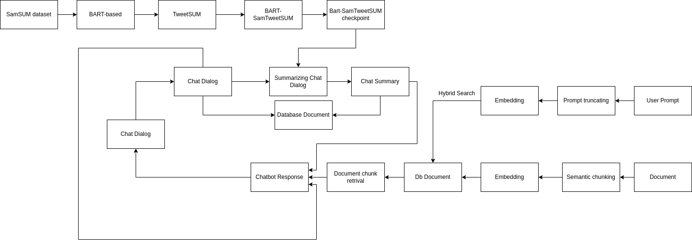

# 📖 Dialog summarization system for a RAG chatbot system

## Table of content
- [Dialog Summarization System for a RAG Chatbot System](#dialog-summarization-system-for-a-rag-chatbot-system)
  - [Summary](#summary)
  - [Project Structure](#project-structure)
  - [Environment Setup](#environment-setup)
  - [Fine-tuning BART-based with SamSUM and TweetSUM](#fine-tuning-bart-based-with-samsum-and-tweetsum)
  - [Chat Bot Execution](#chat-bot-execution)
  - [Performance Comparison with Summary and Without Summary as Context](#performance-comparison-with-summary-and-without-summary-as-context)
  - [Conclusion](#conclusion)
  
## Summary
This project implements a Retrieval-Augmented Generation (**RAG**) chatbot system enhanced with dialog summarization using a **fine-tuned BART** model. The summarization improves response efficiency and context handling in customer-service interactions. The system supports document uploads for Q&A, enhanced retrieval methods, and performance comparison with/without dialog summaries.


## Project structure

```text
ETL_DWH_AWS_Project
├── chatbot
│   ├── chatbotservice/                  # Contains backend service logic for the chatbot
│   │   ├── __init__.py                  # Package initialization
│   │   ├── chatbot_service.py           # Core chatbot service
│   │   ├── chatbotlogsummary_service.py # Service to summarize chatbot logs
│   │   ├── chatlog_service.py           # Service for chat log operations
│   │   ├── texretriever_service.py      # Text retrieval services
│   │   └── vectorHandlingService.py     # Services for vector operations
│   ├── controller/                      # Handles API requests and routing
│   │   ├── __init__.py                  # Package initialization
│   │   └── chatbotcontroller.py         # Main controller for chatbot APIs
│   ├── frontend/                        # Frontend for the chatbot (Streamlit UI)
│   │   ├── __init__.py                  # Package initialization
│   │   └── chatbotui.py                 # Streamlit-based chatbot UI
│   ├── model/                           # Data models for the chatbot system
│   │   ├── __init__.py                  # Package initialization
│   │   ├── chatlog.py                   # Model for chat log data
│   │   ├── chatmessage.py               # Model for individual chat messages
│   │   ├── chatsummarizationrequest.py  # Model for summarization requests
│   │   ├── chatsummarysession.py        # Model for chat session summary
│   │   └── queryresponse.py             # Model for query responses
│   ├── utils/                           # Utility functions for various operations
│   │   ├── __init__.py                  # Package initialization
│   │   ├── database_utils.py            # Database operation utilities
│   │   ├── embedding_utils.py           # Embedding handling utilities
│   │   ├── llmmodel_utils.py             # Language model utilities
│   │   ├── semanticembedding_utils.py   # Semantic embedding-related utilities
│   │   └── weightrepriorcalc_utils.py   # Utility for weighted recalculations
│   ├── .env                             # Environment variables configuration file
│   ├── __init__.py                      # Package initialization
│   └── main.py                          # Entry point for backend (Uvicorn with FastAPI)
├── dataset                              # Datasets for the project
├── docs                                 # Project documentation
├── image                                # Images and assets for the project
├── model_trainning                      # Model training scripts and related files for the BART-based
└── reference                            # Reference materials and documents
```

## Environment setup
To set up the environment for running this project, follow these steps:

### Prerequisites
Ensure you have the following installed on your system:
- **Python 3.10 or higher**
- **pip** (Python package manager)
- **Git** (optional, for cloning the repository)
- **Docker** (optional, for containerized setup)
### Steps for local setups 
1. **Clone the Repository**

   Clone this repository to your local machine:

   ```bash
   git clone git@github.com:husthunterpy01/Dialog-Summarization-System.git
   cd Dialog-Summarization-System
   ```
   Before continuing, here are some notification about setting up **.env** file inside chatbot folder:
   ```text
   # MongoDb Atlas configuration
   MONGO_URI=xxxxxxxxxxxxxxxxxxxxxxxxx
   VECTOR_DB=xxxxxxxxxxxx
   VECTOR_DOCUMENT=xxxxxxxxxxxxxxx
   VECTOR_CONVERSATION_DOCUMENT=xxxxxxxxxxxx
   
   # LLM model Configuration
   LLM_MODEL = "./Dialog-Summarization-System/LLM_Model/granite-3.1-3b-a800m-instruct-Q6_K.gguf"
   FINE_TUNE_MODEL = "./Dialog-Summarization-System/finetunedmodel/fine-tuned-model/checkpoint-1100"
   # FastAPI endpoint
   CHAT_ENDPOINT = http://127.0.0.1:8000/ 
   ```
   - Create a LLM_Model and fine-tuned-model
   - For the **LLM_Model**, visit hugging face and download the .gguf model [Granite model](https://huggingface.co/bartowski/granite-3.1-3b-a800m-instruct-GGUF)
   - For **FINE_TUNE_MODEL**, please download the checkpoint from [BART_SamSUM_TweetSUM](https://huggingface.co/husthunterpy01/BART-SamTweetSUM/tree/main) into the folder and points to the checkpoint you want
   - For **MONGO_URI** configuration, please follow this tutorial [mongodburi_video](https://www.youtube.com/watch?v=LTKgKt_t1JE)
   - For other configurations, you can name the database, document as you want
3. **Application setup with Docker** (You can skip step 3 if conducting by this tep)
   If you prefer running with Docker, please execute this one: 
   ```bash
   docker-compose up --build
   ```
   As you run the application will pop up in the website for usage.
   For further testing with application, after running the command, you can access the service as followed:
   ```text
   Backend (FastAPI): http://localhost:8000
   Frontend (Streamlit): http://localhost:8501   
   ```
4. **Application setup without Docker** 
   In terms where there exists issues with Docker file, you can still setup this project as followed:
   Setup the virtual environment:
   ```bash
   python -m venv venv
   source venv/bin/activate    # For Linux/MacOS
   venv\Scripts\activate       # For Windows
   ```
   Activates the backend webserver
   ```bash
   cd chatbot
   uvicorn main:app --host 0.0.0.0 --port 8000
   ```
   Activates the frontend:
    ```bash
    cd chatbot/frontend
    streamlit run chatbotui.py --server.port 8501 --server.address 0.0.0.0
    ```
   As you run the application will pop up in the website for usage.
   For further testing with application, after running the command, you can access the service as followed:
   ```text
   Backend (FastAPI): http://localhost:8000
   Frontend (Streamlit): http://localhost:8501   
   ```
## Fine-tuning BART-based with SamSUM and TweetSUM
<details>
<summary> Dataset</summary>
In this project, I will conduct on a 2 public dataset called SamSUM(2019) and TweetSUM(2021), in which the 1st will be used for pre-trained and the last one is used for fine-tune purpose.
I have already uploaded 2 datasets to this repos. If you are interested in the original dataset, please see the link below each type of dataset.
 
- **SamSUM dataset**:
 SamSUM is a dataset with the format of messenger-like conversations with summaries, with style and register are diversified.

Dataset link: [Dataset/SamSUM](./Dataset/SamSUM) . For the orignal one, please visit this site [SamSUM](https://paperswithcode.com/dataset/samsum-corpus)
- **TweetSUM dataset**:
TweetSUM is a dataset focused on summarization of dialogs, which represents the rich domain of Twitter customer care conversations

Dataset link: [Dataset/TweetSUM](./Dataset/TweetSUM)  . For the orignal one, please visit this site [TweetSUM](https://github.com/guyfe/Tweetsumm)

Both the dataset will be pre-processed by this script before being fine-tuned by BART-based:
 
</details>

<details>
<summary> Pre-training with BART-base</summary>
 BART-based will first be pre-trained with SamSUM dataset in order to have a better understaanding in general chat format, by the following configuration:
 
 

After the trainning here are some results in terms of ROUGE score for the pre-trained BART-based:

 

Final ROUGE score:

 

Details can be witnessed on wandb records:
 
 

</details>

<details>
<summary> Fine-tuning BART-SamSUM</summary>
 After pre-trainning with BART-based, it will be fine-tuned with TweetSUM for customer-service summary understanding :
 
 

After the trainning here are some results in terms of ROUGE score for the fine-tuned BART-based:

 

Final ROUGE score:

 

Details can be witnessed on wandb records:
 
 
</details>

For the fine-tuned checkpoint, I have already uploaded on huggingface, please visit this site to get the model: [BART_SamSUM_TweetSUM](https://huggingface.co/husthunterpy01/BART-SamTweetSUM/tree/main) 

## Chat bot execution
For the full demo, please download the video at [demo_video](demo_video/) or visit this site [Dialog Summarization System Demo](https://www.youtube.com/watch?v=-LUDuQUJZ8c)
### Document for retrival
In this demo, I use the Iphonne User Guide as the document for this RAG chatbot, referring to [Customer-Service-Handbook-English.pdf](./docs). I have already uploaded some other documents on the Docs Folder for testing, or you can also use other types of documents to test with this chatbot.
The document uploaded will be saved in the vector database, here is a screenshot of a document I have uploaded:

 


### Method for increasing searching performance
As the base RAG architecture does not work well for document retrival in some cases, I have implemented some methods to improve the retrival performance
<details>
<summary> Hybrid search</summary>
   Hybrid search will optimize the strength of both vector-search (contextual search) and key-word search, which is useful in some cases when you need to search for keyword or name of a person that can't be handled properly in terms of single vector search
 
 
</details>

<details>
<summary>Semantic chunking</summary>
 Instead of fixed chunking at a fixed size, using semantic chunking helps user to seperate the chunk into meaningful chunks, which is conducive for later content retrival
 
 
</details>

### Chatbot implementation
This chatbot is built for the customer serivce purpose Q&A for a larger sytstem.
Before getting started, this chatbot is built based on the granite LLM by IBM, for more infomration please visit the site to download the model [Granite_LLM](https://huggingface.co/ibm-granite/granite-3.1-8b-instruct).
In here, I use the Granite version: **Granite-3.1-3b-a800m-instruct-Q6_K.gguf** as the LLM model due to the fact that my P.C only has CPU for execution, and you can find that the chat response in the demo video is a little bit slow due to this fact.
Here is some screenshot on this RAG chatbot system:
- Main screen:

 

- Chat dialog sample:

 

This chatbot allows users to ask question based on document uploaded via the system and some possible knowledge acquired from the LLM model. In the chat, the dialog can be summarized with the use of the BART-SamTweetSUM and saved every time we summarize the data, as well as the whole chatlog session:

 

Reminded that the chat conversation will be saved as the context for the user prompt after each summary. For the 1st time without summary, the whole chat session will be loaded as context.

### Performance comparison with summary and without summary as context
My system also use the latest summary as the context for the user's prompt so as to minimize the time response of the bot to user by reducing the input tokens. To help you understand the impact of having summary as context, I have developed a function to compare the response of the chatbot in terms of using latest summary as context and not using it as context

Here is a sample question to compare:

 

Please enable the comparison so as for the system to calculate the execution time and the input/output token for the response. After the execution, here is the result for the above response:

 
 

As you can see by adding summary as context, the response can be much faster compared to non-summary as context
## Conclusion
- The demo shows how summary can work well with short dialog, but still needs improvement to cover more contents from the prev dialog
- Needs improvement in terms of speed
- Should also takes care of the case of hallucination
- Will later work on web/app development integrated to provide a more friendly chat interface and oriented to the purpose of the application.
